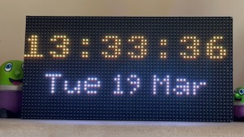
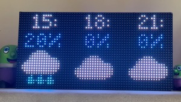

# An LED matrix display for Home Assistant

This is the central component for a project to show various information from a [Home Assistant](http://home-assistant.io) installation on a nice and clear LED-based display. The protocol used is MQTT so in theory other automation platforms can be used:




(More screenshots are in the [assets](assets/) directory.)

The hardware is based around the Raspberry Pi Pico W mounted on a [custom board](https://github.com/aslak3/MDFPGA). Whilst it should be simple enough to port this code to run other Pi Pico W boards, this document assumes you are using a build of my board design.

The following information can currently be shown:

1. Time and Date - The display doubles up as a mantlepiece clock
2. Inside the house temperature information
3. Current weather
4. Weather forecast for the next few hours
5. The next 3 items in the calendar
6. If music is playing somewhere, you can see the track title name, album name and artist name
7. Transport information: two sets of two lines of text for use in showing the time of the next train, bus, etc

The system also supports notifications, which will scroll across the display. Critical and normal notifications are supported. Lastly there is support for displaying an icon when there is movement in the house porch, should such a thing be needed.

The communication link, as mentioned, to the Home Assistant install is via MQTT, with auto-discovery being supported to create a device in Home Assistant for the control and monitoring of the system.

The system runs atop of [FreeRTOS](https://www.freertos.org/). This project uses the  support for SMP mode on the RP2040 on the Pi Pico W.

The display drawing code supports the usual graphical primitives, all utilising the 64x32 screen: proportional and non proportional fonts, icons (used for showing weather state, etc), filled and unfilled boxes, filled and unfilled circles, lines, and a primitive alpha channel scheme for producing a dimmed box suitable for drawing other elements like text atop of. The display output path has a brightness control, allowing the screen's intensity to be scaled according to a brightness value.

# Supported hardware

This firmware is designed to be run on a Pi Pico W attached to a main board I have designed, though it could, in theory, be adapted to other platforms such as those based around an ESP32. The board features the following main components:

* Power via 5V barrel jack
* A Pi Pico W (obviously)
* A [DS3231](https://www.analog.com/media/en/technical-documentation/data-sheets/DS3231.pdf) (PDF) I2C Real Time Clock
  * CR122t battery backup
* IDC16 HUB75 connector attached to the Pico W
* Buzzer
* iCE40UP FPGA
  * [N25Q32A](https://www.mouser.co.uk/datasheet/2/12/Micron_Datasheet_N25Q032A_RevJ-1880047.pdf) (PDF) 32MBit SPI Flash
  * IDC16 HUB75 connector attached to the FPGA
  * LED

It is possible to build the firmware with support for either the attached FPGA or not. If the FPGA is not used, the HUB75 display will be driven via the RP2040 PIO mode, which has some drawbacks including very slight flickering when the RP2040 is under heavy network load. Additionally the firmware can collect the device's own temperature either from the temperature sensor within the DS3231 RTC IC, or from an external [BME680](https://cdn-shop.adafruit.com/product-files/3660/BME680.pdf) (PDF) temperature, humidly, air pressure and gas sensor attached to a breakout board.

# Time and Date

One of the interesting aspets with this design is that the time and date is held in an RTC. The clock is polled 10 times a second and on a second rollover the display is updated. The principle reason for this is simplicity. While obtaining the time via NTP from within an FreeRTOS application is certainly possible, it would complicate the code somewhat. Nonetheless I may change this over in the future. A quirk of this choice is that the time and date must be set in the RTC using a special MQTT message; see below. The system has no concept of timezone as well.

# Configuring Home Assistant

You require a working MQTT setup in your Home Assistant, so make sure that is working before going further. Only non SSL connections are currently supported.

The data shown on the display, beside the time and date, is pushed up to the display via Home Assistant automations using MQTT. This affords a large amount of flexibility in what is shown, vs the display being configured with entities which it is interested in which is an alternative approach I discarded. Eventually I hope to have a nice HA blueprint that makes this part of the setup of the automation easier, but for now these notes will have to suffice.

A [complete example](examples/automation.yaml) of an automation for configuring most aspects of the display is included in this repo. This example is probably slightly out of date, but it should be fairly simple, for the experienced Home Assistant user, to tailor this to any particular setup.

The automation I have running divides the chore of sending up the needed information into four blocks: weather, media player, calendar and porch. The weather information includes the temperature data for inside the house.

Since there are a large number of sources of possible change, the trigger for the weather data publish event is a simple 5 minute timer. For the media player, the trigger is on the player device's Content-ID (which will cover when the current track rolls over to the next track, or if a new track is manually selected), or the player is turned on or off. I'm using the [iCal out-of-tree integration](https://github.com/tybritten/ical-sensor-homeassistant) for my calendar and the calendar trigger is thus the first three entities it creates. The porch trigger is simply the motion sensor's motion entity.

In terms of the actions needed, each trigger produces an MQTT publish of the correctly formatted JSON data. The media player block is simple enough it can be reproduced in full here:

```YAML
service: mqtt.publish
data:
  qos: 0
  retain: false
  topic: matrix_display/media_player
  payload_template: |
    

    {{ result | to_json }}

```

As said above, refer to the complete example automation YAML to get started.

For the source of transport information I have written [my own custom integration](https://github.com/aslak3/go_south_coast) for my local bus company. Other sources are possible; previously I use a Go script, [which I will continue to included here as a source of inspiration](tools/bluestar-parser/bluestar-parser.go), which does MQTT publishing operations based on web-scraped data.

Before creating the automation you should verify basic functionality of your display by activating auto-detection. This is done by sending a MQTT message with the text `ON` in it to the topic `matrix_display/autodetect`.

# MQTT

At the present time only non-SSL connections are supported. Configuration of the MQTT broker details is described in the building section, below.

The following topics are subscribed to by the device:

##  matrix_display/weather

JSON formatted temperature and weather information. Refer to the example automation for the schema.

## matrix_display/media_player

JSON formatted media player information. If the state of the player is anything other than `playing` or `paused` then this screen is skipped.

## matrix_display/calendar

JSON formatted calendar information for the next three appointments.

## matrix_display/scroller

JSON formatted scroller message text. This is an array of upto four messages, each upto 256 characters long. The messages are shown in sequence with a configurable interval between messages.

There is provision to show up and down arrows, intended for showing stock prices and the like. To make use of this use the magic sequence -UP- or -DOWN- in the message text.

## matrix_display/porch

The `states()` of the porch motion sensor. This is not JSON formatted. That is, it needs to be either `on` for motion or `off` for no motion.

## matrix_display/transport

The current transport situation. JSON data of the form:

```JSON
[
    {
        "Towards": "The moon",
        "DeparturesSummary": "1h 3h"
    },
    {
        "Towards": "Mars",
        "DeparturesSummary": "1d 30d"
    }
]
```

(Yes I'm aware those dictionary keys have inconsistent case. Likely because the generator of the data was a Go script.)

Currently only two destinations are supported. Strings need to be kept as short as possible, as no scrolling is done.

## matrix_display/buzzer_play_rtttl

The buzzer can play a [Ring Tone Text Transfer Language](https://en.wikipedia.org/wiki/Ring_Tone_Text_Transfer_Language) tune, allowing you to reminisce about the 1990s. If you weren't alive then: RTTTL is a simple text format describing the pitch and duration of a sequence of notes. 1990s phones used these phones as ringtones.

Why you'd want to do this I'm not quite sure, but it is pretty neat and I had fun writing the code, and testing it out with different tunes I found online.

Here is a rendition of the Mission Impossible theme:

```
mission_imp:d=16,o=6,b=95:32d,32d#,32d,32d#,32d,32d#,32d,32d#,32d,32d,32d#,32e,32f,32f#,32g,g,8p,g,8p,a#,p,c7,p,g,8p,g,8p,f,p,f#,p,g,8p,g,8p,a#,p,c7,p,g,8p,g,8p,f,p,f#,p,a#,g,2d,32p,a#,g,2c#,32p,a#,g,2c,a#5,8c,2p,32p,a#5,g5,2f#,32p,a#5,g5,2f,32p,a#5,g5,2e,d#,8d
```

## matrix_display/notification

A plain text message to present, wrapped in a dictionary:

```JSON
{
  "critical": true,
  "text": "This is a very important notification",
  "rtttl_tune": "... tune data ..."
}
```

The screen is flashed white, the buzzer will play some tones, and the message will be scrolled across the screen in large lettering. If a critical message is shown, it will be shown in red text and will be shown 3 times, and the beeps are a little more "aggressive".

Note that `rtttl_tune` is optional. If it is missing the standard beeps, for that level of criticality, are played.

## matrix_display/set_time

Sets the time in the RTC. The message body should be a textual version of the bytes to send to the RTC IC, per the datasheet. The format is BCD and is:

1. Seconds
2. Minutes
3. Hours
4. Day of the week
5. Day in the month
6. Month
7. Year (sans 20xx)

That is the message should be exactly 14 bytes long. Day 1 is Sunday.

## matrix_display/panel/switch

This is the "switch" part of the light, which is used to control the brightness of the panel. Set it to on or off.

## matrix_display/panel/brightness/set

Sets the intensity of the panel, from 0 to 255.

## matrix_display/grayscale/switch

Set to on to enable grayscale mode. I added this just for the fun of doing so; it's likely not very useful.

## matrix_display/configuration/

This is the root of around ten configuration parameters which can be used to alter the behavior of the display. They are described below.

## matrix_display/autodiscover

Activate autodiscovery by sending ON (case sensitive). The system will send a set of responses back via MQTT which will create:

* A "light" for setting the brightness of the panel
* A switch for the grayscale mode
* A number for configuring the number of snowflakes on the screen (see the configuration section)
* Temperature, pressure and humidity sensors
  * If the BME680 is not enabled at build time, only the temperature sensor will be created

# Configuration via MQTT

A number of topics are recognised as configuration parameters. All of these appear under `matrix_display/configuration/`. The default value is given in parens:

* `clock_duration` (1000) : The number of frames that the clock is shown for.
* `clock_colon_flash` (0) : The frame count with which the colons in the time hold their steady state. 20 is a good rate. 0, the default, to disable the flashing.
* `inside_temperatures_scroll_speed` (3) : The number of frames between each vertical pixel movement on the inside temperatures screen.
* `current_weather_duration` (200) : The number of frames the current weather screen is displayed for.
* `weather_forecast_duration` (500) : The number of frames the weather forecast screen is displayed for.
* `media_player_scroll_speed` (1) : The number of frames between each horizontal pixel movement for this screen.
* `calendar_scroll_speed` (3) : A vertical scroll is used on the calendar screen. This is the number of frames between movements.
* `transport_duration` (300) : The number of frames the transport information appears on screen.
* `scroller_interval` (10000) : The number of frames between the "scroller" appearing at the bottom of the screen. After the message has been scrolled across the screen the next message in the queue of up to four will be shown.
* `scroller_speed` (2) : And the speed of the scroller.
* `snowflake_count` (0) : The count of snowflakes to show.

*Notes:*

It's a little annoying using frame counts for lengths of time, but it is the most exact way to measure time in the animation system. For a static screen, the frame rate is just under 100 frames a second on my display. Thus the clock appears for around 10 seconds by default.

To suppress a screen, set its duration to zero.

The scroller is intended to display extra tidbits of information over the top of anything else that might be on the screen at any one time. An array of upto four messages can be passed in and are shown in sequence with a configurable delay between them. I currently use this fascility to present detailed information on the current weather conditions and for showing current prices for a few stocks, all formatted with the [templating](https://www.home-assistant.io/docs/configuration/templating/) capabilities of Home Assistant.

Snowflakes are only for Christmas! At least if you are in the northern hemisphere. A simple algorithm is used to move white pixels around, and this configuration item sets the count of snowflakes. Past about 50 snowflakes the screen is hard to read, but the effect is still quite pleasant. Snowflakes make use of a special feature in the display code: snowflake pixels will appear at maximum brightness regardless of the brightness setting.

# Ideas for Automations

One of the first things I automated was to turn the panel off when it isn't needed. This was straightforward for me as I have a reliable presence sensor setup in my lounge, where I have my display. I simply turn the panel "light" off when the room is empty, just like the lights in the ceiling. I also have my transport parser Go script check on the light state to know if it should make the query to the local bus company's website. I do this to do my bit to lessen the load on the website, and reduce the chance that they notice a pattern in requests from my IP and block my access, which would be irritating.

All of the notifications that happen in my Home Assistant setup go through an automation script. This script can, based on how it is called, generate alerts on the user phones, or it will speak the notification via the Nabu-Casa Text To Speech service, or it will put the notification on the matrix display via an MQTT publish service call. I use notifications for such things as:

* When it's going to rain (it might be fun to try to get the buzzer to play back some pitter-patter noises)
* When Home Assistant detects someone is on their way home
* Upcoming appointments in the calendar

It might be useful to control the screen brightness using the time of day or room light level, but I've not yet bothered with such details.

# Building

The build system is cmake. There are a number of configuration options which must be set by creating a file in the source tree called `private.cmake`. This should resemble the following:

```
set(WIFI_SSID               wifi-ssid)
set(WIFI_PASSWORD           wifi-password)
set(SPI_TO_FPGA             1)
set(MQTT_BROKER_IP          10.0.0.1)
set(MQTT_BROKER_USERNAME    user)
set(MQTT_BROKER_PASSWORD    password)
set(BME680_PRESENT          1)
```

The resultant build/matrix-display.uf2 then needs to be transfered to the Pico W board.

If `SPI_TO_FPGA` is set to 0, the HUB75 panel will need to be plugged into header that is directly connected Pi Pico W pins. Otherwise it should be attached to the FPGA's HUB75 header, once again assuming you are using the board which I have designed.

If `BME680_PRESENT` is set to 1, a BME680 breakout board like [this one](https://thepihut.com/products/adafruit-bme680-temperature-humidity-pressure-and-gas-sensor-ada3660) should be attached to the I2C bus. Note that the SDO pin should be connected to ground, which will yield the correct slave address of `0x76`. In this case the temperature, humidity and pressure sensor values will come from this board. Otherwise, if `BME680_PRESENT` is 0, then the temperature information will come from the RTC IC on the board alone.

'MQTT_BROKER_PORT` can be used to set the MQTT port number, should the default 1883 not be used.

The following options are mandatory:

`WIFI_SSID` should be set to the SSID (network name) the Wi-Fi will be connecting too. `WIFI_PASSWORD` should be set to the network password.

`MQTT_BROKER_IP` should be to the IP (v4) host running MQTT, with `MQTT_BROKER_USERNAME` and `MQTT_BROKER_PASSWORD` being set to the needed credentials for the broker.

Trrigger a build via the shell:

```sh
mkdir build
cd build
cmake ..
make
```

The resultant `build/matrix-build.uf2` should then be copied to the Pi Pico W.

# Tracing

Debug output is produced as the system runs. It can be captured on the Pico W's USB port or the UART on GPIO0 and GPIO1. Note that even if there are issues connecting the Wi-Fi, you should still see the clock on the LED matrix. A TODO item is to make the display useful for emitting errors, eg MQTT disconnects.

# Ideas for future work

Clearly the scope for such a display as this is fairly limitless. The following is a randomly ordered list of ideas. Some of these changes are possible without touching the firmware code.

* Display the latest sports scores.
* Display a list of the newest YouTube videos for creators the user is subscribed to.
* Somehow suppress the transport information screen when it's not needed. Unsure how this could be done though.
* Consider scrolling through more future hours on the weather forecast screen, eg. the next six 3 hours-apart forecast instead of just the next three. It might be distracting to look at though.
* Consider more configurability of the screen, for instance text colours.
* The ability to display arbitrary images or possibly small animation sequences might be cute. There's a number of ways to do this. One obstacle is it would probably require SSL support and a HTTP client.

# Related Projects

* [MDFPGA](https://github.com/aslak3/MDFPGA) The PCB design for the base board.
* [HUB75 Controller](https://github.com/aslak3/hub75-controller) A HUB75 LED matrix controller implemented in Verilog.
* [Go South Coast integration](https://github.com/aslak3/go_south_coast) My integration for retrieving bus times for the local, to me on the south coast of England, bus company.
